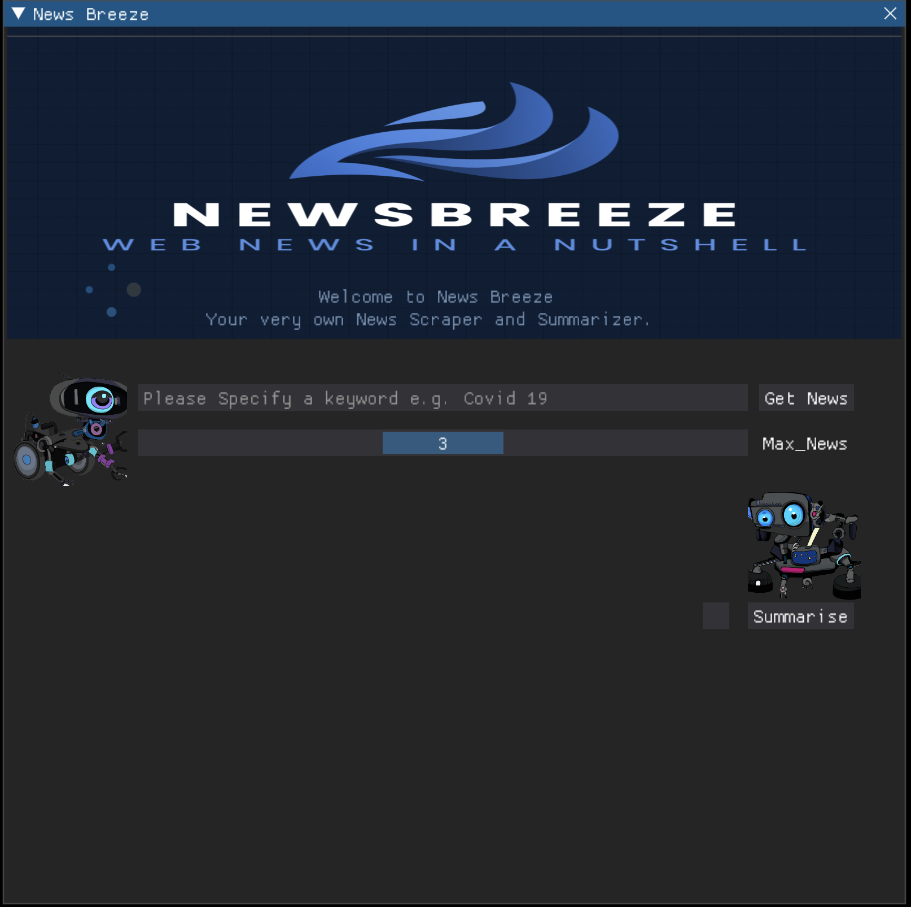
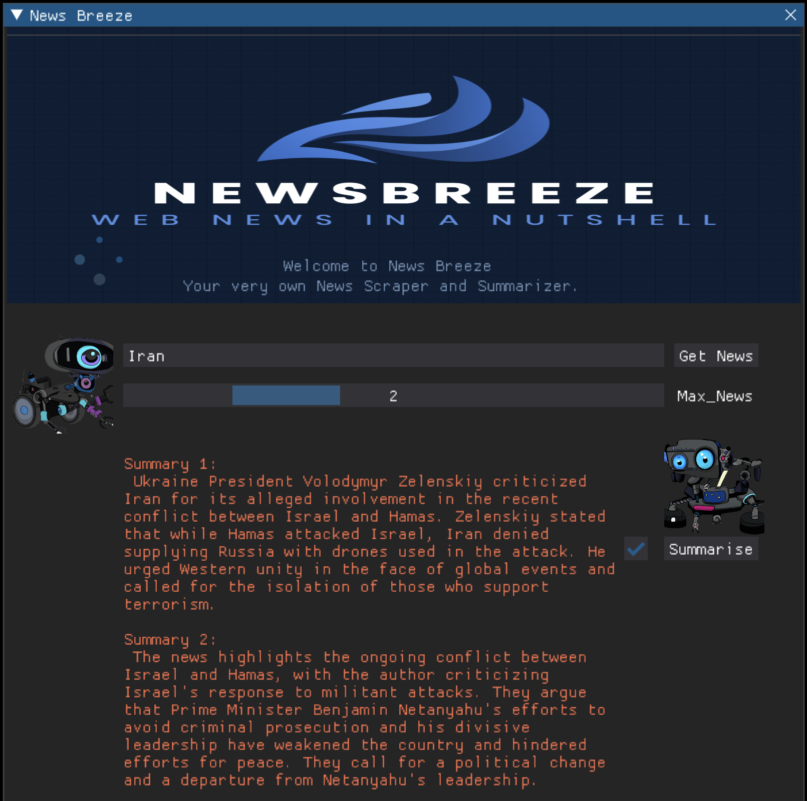

<h1>  News Breeze: A scraping and Summarizing app</h1>

#### [![Video Demo][video]][video-url] 
[![Linkedin][linkedin]][linkedin-url]

<div style="display: flex; align-items: center;">


</div>


## __Table of Contents__

- [Description](#description)
- [Built With](#built-with)
- [Project Structure](#project-structure)
- [Features](#features)
- [Getting Started](#getting-started)
  - [Prerequisites](#prerequisites)
  - [Testing and Development Dependencies](#testing-and-development-dependencies)
- [Usage](#usage)
- [LICENSE](#configuration)
- [Acknowledgements](#acknowledgements)


## __Description__

The News Scraping and Summarization App is a simple Python application that allows users to scrape news articles based on a keyword and optionally summarize them. The app provides a user-friendly interface built using dearpygui and utilizes Hydra for configuration. The app utilizes openai api to call Chatgpt or GPT3.5 turbo model to summarise the collected news. Once the User provides a keyword, and selects the number of news articles required (Max 5). The App utilizes a  Scrapy Spider  to collect the relevant news Articles using NewsData.io API. 


## __Built With__
* [![Scrapy][scrapy.py]][scrapy-url]
* [![Hydra][hydra.py]][hydra-url]
* [![Spacy][spacy.py]][spacy-url]
* [![OpenAI][openai.py]][openai-url]
* [![DearpyGUI][dearpygui.py]][dearpygui-url]

## __Project Structure__
* `Clean_News:` Folder that has the clean module for preprocessing the news using Spacy.
* `conf:`  Hydra Configurations are stored here in a `config.yaml` file.
* `data:`  Raw news, Cleaned news and Summarised news are stored in this folder in json files.
* `images:` Project images such as logo and robot images are stored here.
* `Scrapy_Project:` This folder contains the scrapy code, along with the spider to crawl news from Newsdata.io API
* `summarise:` This folder contains the summarise module with OpenAI API code to generate summarise for the news.
* `output:` Hydra outputs are stored here. 
* `project.py:` Main project code.
* `test_project.py:` Unit tests for the code.


## __Features__

- Scraping news articles based on a user-provided keyword.
- Specifying the number of news articles to scrape.
- Summarizing scraped news articles using GPT 3.5 Turbo from OpenAI.
- Real-time feedback on the scraping progress.
- Customizable configuration using Hydra.
- Logging information such as Errors, Warnings.

## __Getting Started__
Follow these steps to run the project in your local 
## __Prerequisites__

Before running the application, make sure you have the following installed:

- Python (3.7 or higher)
- Pip (Python package manager)
- Pipenv

 ### __Packages Requirements__
 Since the project relies on pipenv package manager, There is a requirements.txt in the root folder, you can utilize the following command to install all necessary packages
 you can do the following
    
    $ cd project
    $ pipenv install -r requirements.txt 
or you can try to do this 

    # make sure to have pipenv installed
    $ pip install pipenv

    # set up venv and install dependencies with pipenv
    $ pipenv sync

    # run the application
    $ pipenv run python3 project.py

### __Testing and Development Dependencies__

To set up a development environment for this project with `pipenv`:

``` bash
make dev
```

To perform unittests with `pytest`:

``` bash
make tested
```

Or, if you don't have `build-essential` installed.

```bash
# install development dependencies
pipenv install --dev

# perform unittest
pipenv run pytest
```

</br>
<hr>
</br>

## __Usage__
To Get started, simply run the command `python3 project.py` and this will launch the DearpyGui app, once the app is launched, provide a keyword or multiple keywords, select the total number of news articles you want,( for now i have set max number at 5). Then simply click `"Get News"` button. This will initiate the scrapy spider, and after scraping the relevant articles, dump the data into a json file. The app then takes the data from the json file, extracts the `Title`, `Author` and `Published date` and displays it on the GUI. Now you have the option of getting the summary of the news. With how busy our lives are, no one has the time to read through thousands of words or article for a single topic. Rather why not have GPT to summarise the news in a few lines for us. This is exactly what the APP does. Once you `check the summarise box` and click on the `"Summarise"` Button. The cleaner module will take over, and using Spacy module it will preprocess the data, and pass it to the summariser module which basically calls OPENAI's GPT 3.5 API to summarise the content of the news articles in a few lines. And Viola in a few seconds you have a short quick summary of the necessary news articles.


## __LICENSE__
Distributed under the MIT License. See `LICENSE.txt` for more information.


## __Acknowledgements__

Thank you to David Malan and his entire team for helping to make the harvard CS50P course accessible to everyone who wants to learn, and teach it in such an astounding way.

<!-- Markdown LINKS & IMAGES -->
[scrapy.py]: https://img.shields.io/librariesio/dependents/pypi/hydra?style=for-the-badge&logo=Scrapy&logoColor=green&label=Scrapy

[hydra.py]: https://img.shields.io/librariesio/dependents/pypi/hydra?style=for-the-badge&logo=Hydra&logoColor=blue&label=Hydra&color=red

[spacy.py]: https://img.shields.io/librariesio/dependents/pypi/spacy?style=for-the-badge&logoColor=black&label=Spacy&color=orange

[openai.py]: https://img.shields.io/librariesio/dependents/pypi/openai?style=for-the-badge&logoColor=black&label=OpenAI&color=green

[video]: https://img.shields.io/badge/Video-Demo?style=for-the-badge&label=Video-Demo
[linkedin]: https://img.shields.io/badge/Linked-in?style=for-the-badge&logo=Linkedin&labelColor=blue&color=black

[dearpygui.py]: https://img.shields.io/librariesio/dependents/pypi/dearpygui?style=for-the-badge&logo=DearpyGUI&label=Dearpygui&labelColor=grey&color=blue


[scrapy-url]: https://github.com/scrapy/scrapy

[hydra-url]: https://github.com/facebookresearch/hydra
[spacy-url]: https://github.com/explosion/spaCy
[openai-url]: https://github.com/openai/openai-python
[video-url]: https://youtu.be/oVnLbPcc34o
[linkedin-url]: https://www.linkedin.com/in/uzairaslam01/
[dearpygui-url]: https://github.com/hoffstadt/DearPyGui/tree/master
